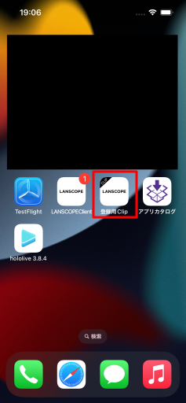
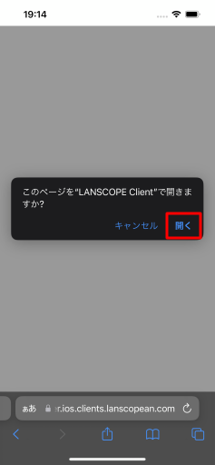
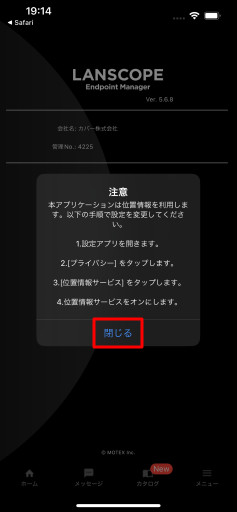
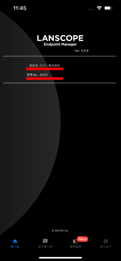
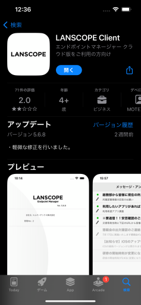

# 6. LANSCOPE Clientの初期設定をする

インストールされた登録用Clipをタップします。

『**このページをLANSCOPE Clientで開きますか？**』とダイアログが表示されます。
**開く**をタップします。

注意画面が出ますが、そのまま**閉じる**をタップします。

LANSCOPE Clientに**会社名**と**管理No**が表示されます。  
会社名は**カバー株式会社**と表示されます。

:::info
表示されない場合、LANSCOPE Clientを再起動することで反映されることがあります。
:::

:::note
LANSCOPE Clientがない、または、消してしまった場合はAppStoreからダウンロードし直すことで復元できます。

:::

次は、いよいよ[ホロライブアプリをインストール](../B/install-hololiveapp.md)しましょう！
