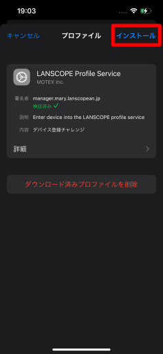
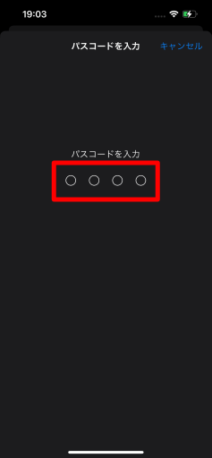
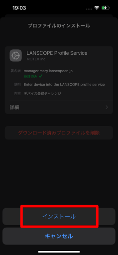
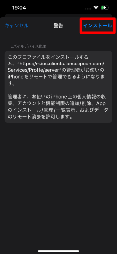
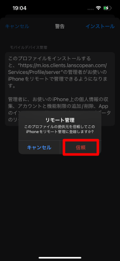
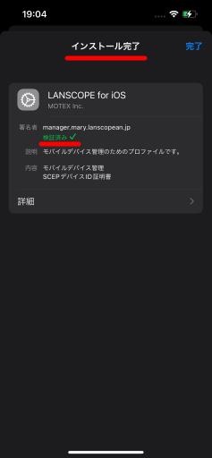

# 5. LANSCOPE Clientをインストールする

プロファイル画面右上の**インストール**をタップします。

**パスコード**を要求されるので、ロックを解除します。

下から出てくる**インストール**をタップします。

警告画面が出ますが、問題ないので右上の**インストール**をタップします。

**リモート管理**のダイアログが出ます。
**信頼**をタップします。

インストール完了画面が出ます。
検証済み✓と出たら完了です。

ホーム画面に戻り、下記アプリがインストールされていたら、次は[LANSCOPE Clientの初期設定](initialize-lanscope-client.md)をしましょう。

- LANSCOPE Client
- 登録用Clip
- アプリカタログ

:::caution
3つのアプリがダウンロードされない場合、LANSCOPE側の設定漏れの可能性があります。
タレントアプリチームへご連絡ください。
:::