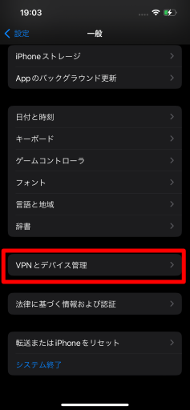

# 4. iPhoneの設定からLANSCOPEのプロファイルを開く

ホーム画面から**設定**を探してタップします。

設定の項目から**一般**を探してタップします。

一般の項目から**VPNとデバイス管理**を探してタップします。

**ダウンロード済みプロファイル**にある**LANSCOPE Profile Service**をタップします。

:::note
**LANSCOPE Profile Service**が表示されていない場合、プロファイルデータのダウンロードに失敗している可能性があります。  
「[3. LANSCOPE Clientをダウンロードする](download-lanscope-client.md)」を再度お試しください。  
改善されない場合は、タレントアプリチームへお問い合わせください。
:::