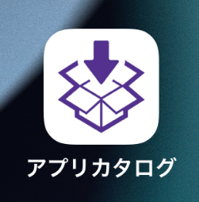
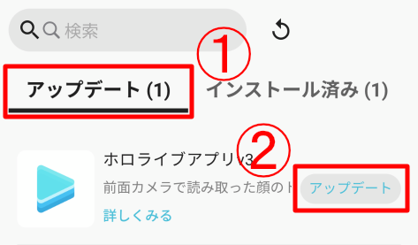
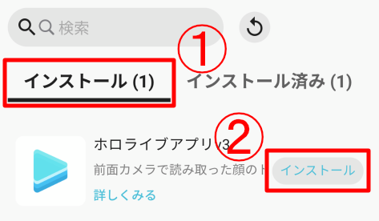
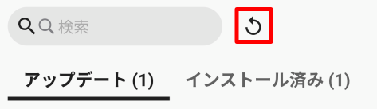
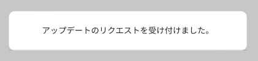
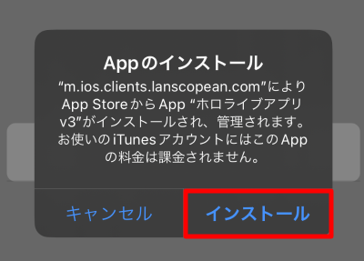
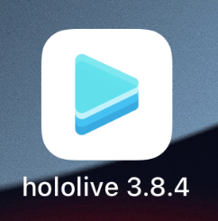
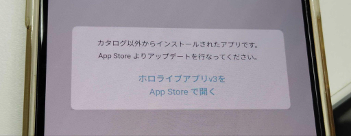
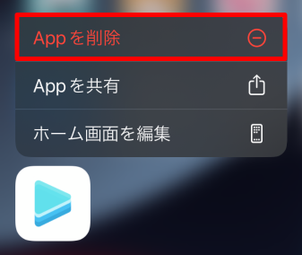
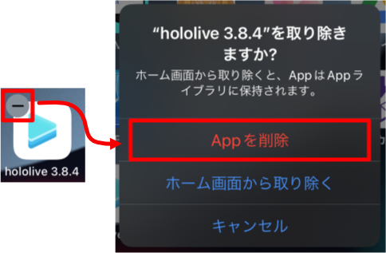

# ホロライブアプリをインストールする

アプリカタログをタップします。

画面上部の**アップデート**、または、**インストール**をタップすると、**ホロライブアプリv3**が表示されます。  
**アップデート**、または、**インストール**をタップしてください。

:::caution
ホロライブアプリv3が表示されていない場合は、画面上部の**更新ボタン**をタップしてください。  
それでも表示されない場合は、タレントアプリチームまでご連絡ください。

:::

「**アップデートのリクエストを受け付けました。**」と出ます。

**Appのインストール**のダイアログが表示されます。  
インストールをタップしてください。

ホーム画面に戻り、ホロライブアプリがインストールされていれば完了です！  

:::caution
以下の現象が起きてホロライブアプリを起動できなかった場合、一度ホロライブアプリを削除後、iPhoneを再起動し再度ダウンロードしてください。
- ホロライブアプリをアップデートできなかった場合
- アプリ起動時に「カタログ以外からインストールされたアプリです。App Storeよりアップデートを行なってください。」と出た場合

ホロライブアプリを削除する方法
1. ホロライブアプリを長押しする
2. 以下の画像にしたがって削除する

:::
