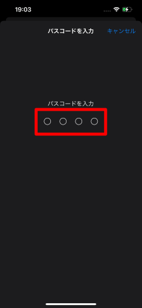
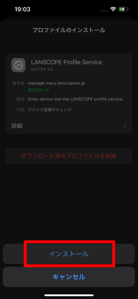
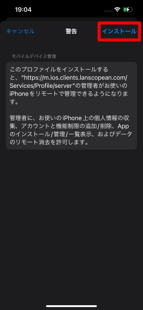
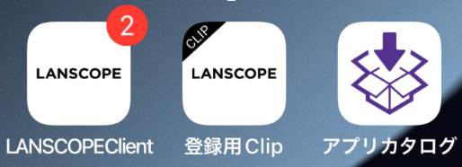

# 5. LANSCOPE Clientをインストールする

1. プロファイル画面右上の**インストール**をタップします。  

2. **パスコード**を要求されるので、ロックを解除します。  

3. 下から出てくる**インストール**をタップします。  

4. 警告画面が出ますが、問題ないので右上の**インストール**をタップします。  

5. **リモート管理**のダイアログが出ます。
**信頼**をタップします。  

6. インストール完了画面が出ます。
検証済み✓と出たら完了です。  

7. ホーム画面に戻り、下記アプリがインストールされていたら、次は[LANSCOPE Clientの初期設定](initialize-lanscope-client.md)をしましょう。  
- LANSCOPE Client
- 登録用Clip
- アプリカタログ  

:::note
3つのアプリがダウンロードされない場合、LANSCOPE側の設定漏れの可能性があります。
タレントアプリチームへご連絡ください。
:::