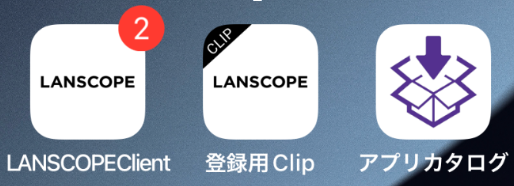

# はじめに

iOS版のホロライブアプリのインストール方法について説明します。  

iOS版のホロライブアプリは「**アプリカタログ**」というアプリからインストールできます。  
アプリカタログを使用するためには下記の3つのアプリが必要です。

1. LANSCOPE Client
2. 登録用Clip
3. アプリカタログ

これらのアプリが入っていない場合は[A. カタログ環境アプリが入っていない場合](A/prepare-iphone.md)を、  
入っている場合は[B. カタログ環境アプリが入っていない場合](B.md)を参照してください