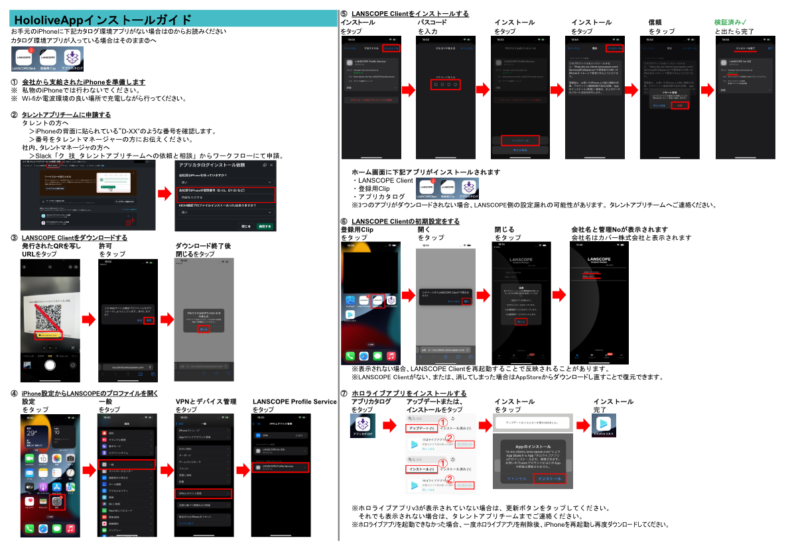

# はじめに

iOS版のホロライブアプリのインストール方法について説明します。

:::info
簡略版は[こちら](/pdf/hololiveapp-install-guide.pdf)  

:::

iOS版のホロライブアプリは「**アプリカタログ**」というアプリからインストールできます。  
アプリカタログを使用するためには下記の3つのアプリが必要です。

1. LANSCOPE Client
2. 登録用Clip
3. アプリカタログ  

これらのアプリが入っていない場合は[1. 事前準備](prepare-iphone.md)を、  
入っている場合は[7. ホロライブアプリをインストールする](install-hololiveapp.md)を参照してください。
