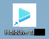
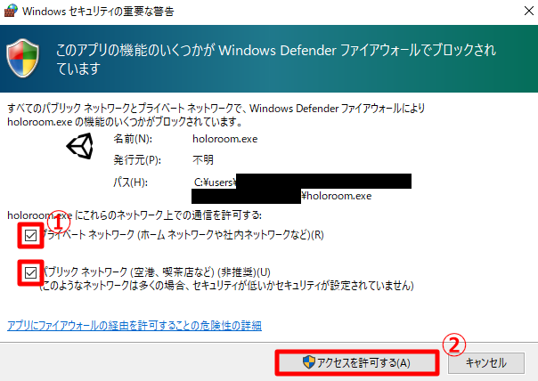

# インストール

Discordで公開しているURLから、最新版のアプリのインストーラをダウンロードしてください。

（URL先の画像を貼る）

インストール後、デスクトップのショートカットをダブルクリックして起動してください。

:::note
初回起動時に「**Windowsセキュリティの重要な警告**」というウィンドウが表示されます。  
**すべてのチェックボックスにチェックを入れてから**、**アクセスを許可する**をクリックしてください。

:::