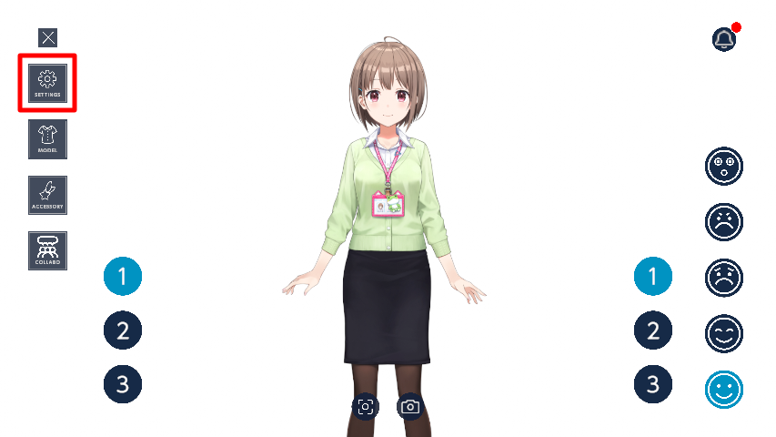

# 配信の始め方

## OBSにモデルを入れる

1. **Spout2**というプラグインを以下のリンクからインストールします。  
https://github.com/Off-World-Live/obs-spout2-plugin/releases

2. OBSのソースから「**Spout2 Capture**」を追加してください。  

3. プロパティを以下のように設定します。
- SpoutSenders : HoloLiveApp_Build_Spout 
- composite : Default
- Poll time for new senders : fast  

:::info
キャラクターだけ送信したい場合は、以下の手順を行ってください。
1. **SETTINGS**をクリックします。  

2. **背景透過**にチェックを入れます。  

:::
