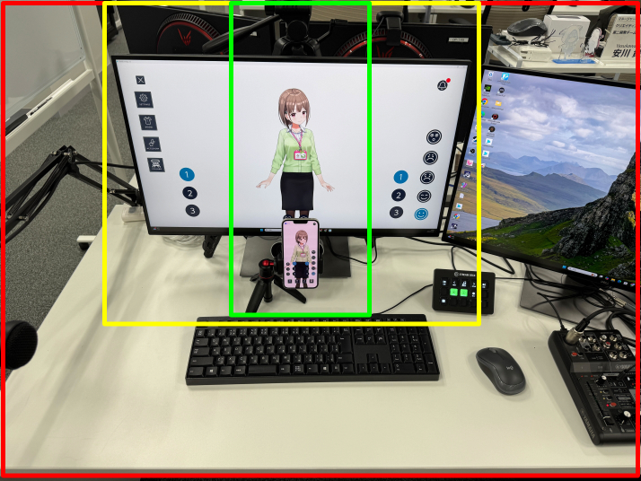
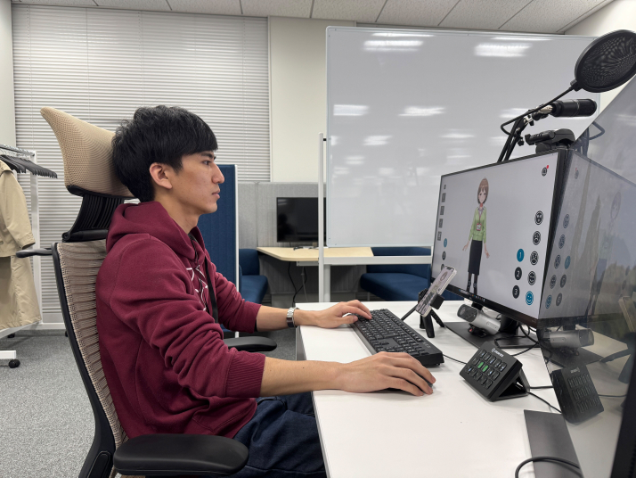
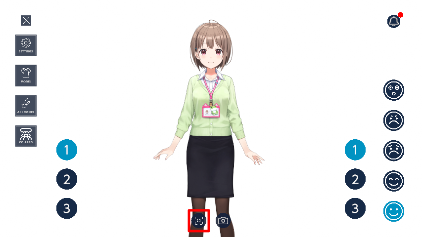

# 初期設定

PC版とiOS版の両方のホロライブアプリを操作する必要があります。  
PC版の手順であれば「【PC】」を、iOS版の手順であれば「【iOS】」を手順説明のはじめに記載します。

## 言語設定

  
PC版で言語設定をする

1. 【PC】**SETTINGSボタン**をクリックします。
   
2. 【PC】**Language**から使用する言語を選択してください。  
   

  
iOS版で言語設定をする

1. 【iOS】**SETTINGSボタン**をタップします。  
   
2. 【iOS】**Language**から使用する言語を選択してください。  
   

## iPhoneからフェイストラッキング情報を送信する

1. 【PC】**SETTINGSボタン**をクリックします。    

2. 【PC】**フェイストラッキングボタン**をクリックします。  

3. 【PC】**QRコードを表示**をクリックします。  

4. 【PC】QRコードが表示されたことを確認します。  

5. 【iOS】**SETTINGSボタン**をタップします。  

6. 【iOS】**QRコード読み込み**をタップします。  

7. 【iOS】4.の手順で表示したQRコードを読み取ってください。  

8. 【PC】 【iOS】目をパチパチしたり、口をパクパクすると、キャラクターも動くことを確認してください。  
（動画）

:::note
以上の操作をしても顔の同期ができない場合はFAQ(リンク差し込み予定)をご確認ください。
:::

## キャリブレーションする

1. iPhoneのカメラを正面に置いてください。
   - 緑：正確にフェイストラッキングが動作します。
   - 黄：正確に動作するとは限りません。
   - 赤：動作しません。  

2. 楽な姿勢で正面のモニタの中央を向いてください。
（画像はイメージ図です。）

3. 【PC】2.の姿勢のまま、画面下部のキャリブレーションボタンをクリックしてください。  

4. 【PC】顔を右に傾けると、キャラクターも自分から見て右に傾けることを確認してください。  
（動画）
