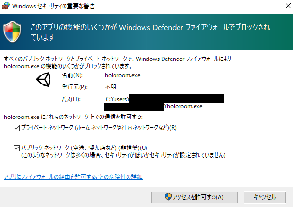

# マニュアルHTML化テスト

# ホロライブアプリv3 マニュアル

# インストール&ログイン

## **インストール方法（Windows PC）**

Discordで公開しているURLから、最新版のアプリのインストーラをダウンロードしてください。

インストール後、デスクトップのショートカットをダブルクリックして起動してください。

（チェックボックスがONでない場合、iPhoneとの通信が失敗する場合があります。）

初回起動時に右のようなウィンドウが表示されます。両方のチェックボックスをONにして「アクセスを許可する」をクリックしてください。

## **インストール方法（iOS版）**

iOS版のホロライブアプリは**「アプリカタログ」**で管理を行っています。

TestFlightから順次移行を実施しております。

アプリカタログへの移行に関しては、

[**コチラ**](https://drive.google.com/file/d/1dKE0YNbGgZh6UKjKoBuoZudpY0C-juU9/view?usp=sharing)

を御覧ください。

## ログイン

1. 「Googleでログイン」をクリックしてください。
2. （「パスワードでログイン」はスタッフ用になります。）
3. 「Googleでログイン」をクリックしてください。
4. （「パスワードでログイン」はスタッフ用になります。）

# 初期設定と配信開始までの流れ

## **初期設定**

ログイン後、「SETTINGS」ボタンを押します。

## **言語選択**

## **iPhoneから表情トラッキング情報の送信**

## **顔の向きのキャリブレーション**

## **モデルの選択**

## **アクセサリの選択**

# 画面と操作説明

# コラボ機能

# 共通アクセサリ機能

# 画像貼り付け機能

# 顔の動き調整（3D）

# iPhoneハンドトラッキング